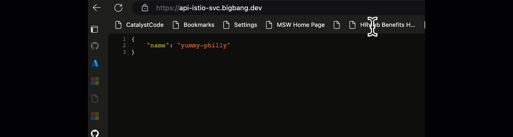

This repository includes a simple Python Flask API with a single route that returns JSON.
You can use this project as a starting point for your own Micro Service APIs.

The repository is designed for use with [Docker containers](https://www.docker.com/), [Big Bang's](https://p1.dso.mil/services/big-bang) Istio [Package](https://repo1.dso.mil/big-bang/product/packages/istio-controlplane), both for local development and deployment, and includes infrastructure files for deployment to [Azure Kubernetes Service](https://learn.microsoft.com/en-us/azure/aks/) utilizing [Application Insights](https://learn.microsoft.com/en-us/azure/azure-monitor/app/app-insights-overview?tabs=net) for Micro Service Observability and [Keyvault's CSI Provider](https://learn.microsoft.com/en-us/azure/aks/csi-secrets-store-driver) for Secret Mounting. 🐳

The code is organized using [Flask Blueprints](https://flask.palletsprojects.com/en/2.2.x/blueprints/),
tested with [pytest](https://docs.pytest.org/en/7.2.x/),
linted with [ruff](https://github.com/charliermarsh/ruff), and formatted with [black](https://black.readthedocs.io/en/stable/).
Code quality issues are all checked with both [pre-commit](https://pre-commit.com/) and Github actions.

## Opening the project

This project has [Dev Container support](https://code.visualstudio.com/docs/devcontainers/containers), so it will be be setup automatically if you open it in Github Codespaces or in local VS Code with the [Dev Containers extension](https://marketplace.visualstudio.com/items?itemName=ms-vscode-remote.remote-containers).

If you're not using one of those options for opening the project, then you'll need to:

1. Create a [Python virtual environment](https://docs.python.org/3/tutorial/venv.html#creating-virtual-environments) and activate it.

2. Install the requirements:

    ```shell
    python3 -m pip install -r src/requirements-dev.txt
    ```

3. Install the pre-commit hooks:

    ```shell
    pre-commit install
    ```

## Local development

1. Run the local server:

    ```shell
    python3 -m flask --debug --app src/app:app run --port 5000
    ```

2. Click 'http://127.0.0.1:5000' in the terminal, which should open a new tab in the browser.

### Local development with Docker

You can also run this app with Docker, thanks to the `Dockerfile`.
You need to either have Docker Desktop installed or have this open in Github Codespaces for these commands to work.

1. Build the image:

    ```
    docker build --tag flask-app src/
    ```

2. Run the image:

    ```
    docker run --publish 5000:5000 -e APPLICATIONINSIGHTS_CONNECTION_STRING=<replace-with-the-provisioned-app-insight-conn-string> flask-app
    ```

### Prerequisites

1. Sign up for a [free Azure account](https://azure.microsoft.com/free/) and create an Azure Subscription.
2. Install the [Azure Developer CLI](https://learn.microsoft.com/azure/developer/azure-developer-cli/install-azd). (If you open this repository in Codespaces or with the VS Code Dev Containers extension, that part will be done for you.)
3. Provision a Platform One Cluster using the AZD Platform One / Big Bang (AKS) Software Factory [Template](https://github.com/cse-labs/azd-platform-one-aks-template).

### Deployment


This repo is set up for deployment on Azure Kubernetes Service using the configuration files in the `infra` folder.

Steps for deployment:

1. Login to Azure:

    ```shell
    azd auth login  -—tenant-id <replace-with-your-tenant-id>
    az login -t <replace-with-your-tenant-id>
    ```

2. Provision and deploy all the resources:

    ```shell
    azd up
    ```
    It will prompt you to provide an `azd` environment name (like "flask-app"), select a subscription from your Azure account, and select a location (like "eastus"). The setup wizard will prompt you for which AKS cluster you want to use to target your service deployment. All AKS clusters provisioned using the AKS Platform One [template](https://github.com/cse-labs/azd-platform-one-aks-template) will appear in the drop down menu. Then it will provision the resources in your account and deploy the latest code. If you get an error with deployment, changing the location can help, as there may be availability constraints for some of the resources.

3. When `azd` has finished deploying, you'll see an endpoint URI in the command output. Visit that URI, and you should see the API output! 🎉



### Distributed Tracing and Log Reporting


This template integrates Application Insights for distributed tracing and log reporting. An Azure Monitor [custom dashboard](https://github.com/cse-labs/azd-platform-one-aks-template/blob/main/infra/azure/modules/applicationinsights-dashboard.bicep) is also provisioned to summarize all traces, logs and errors across your service mesh fleet. You can reference this [tutorial](https://learn.microsoft.com/en-us/azure/azure-portal/azure-portal-dashboards-create-programmatically) to create your own custom dashboard and export the bicep file into the `infra` folder. To view the distributed tracing and log reporting, follow these steps:

### Continuous integration/continuous deployment


The workflow [azure-dev.yaml](./.github/workflows/azure-dev.yaml) uses the Azure Developer CLI container image which has the CLI installed to login to the Azure environment with `azd login`, provision the infrastructure with `azd provision`.

To configure the GitHub repository with the secrets needed to run the pipeline, you'll need to run `azd pipeline config`.

Since the infrastructure template requires setting up some role assignments, the created service principal will need to have `Owner` permissions on the resource group.

```sh
azd pipeline config --principal-role Owner 
```

Once you do so, and if you commit your changes, you should see the pipeline running to build and deploy your application.

#### Configure Control Plane Secrets and Environment Variables

This solution provides a post pipeline setup script which uploads the required variables and secrets to the Github Repository. You'll be able to run the Github Action workflow once you run the below script:

```sh
chmod -R +x ./scripts/postpipelineconfig.sh && ./scripts/postpipelineconfig.sh
```

### Costs

Pricing varies per region and usage, so it isn't possible to predict exact costs for your usage.
The majority of the Azure resources used in this infrastructure are on usage-based pricing tiers.

You can try the [Azure pricing calculator](https://azure.com/e/9f8185b239d240b398e201078d0c4e7a) for the resources:

- Log analytics: Pay-as-you-go tier. Costs based on data ingested. [Pricing](https://azure.microsoft.com/pricing/details/monitor/)

⚠️ To avoid unnecessary costs, remember to take down your app if it's no longer in use,
either by deleting the resource group in the Portal or running `azd down`.

